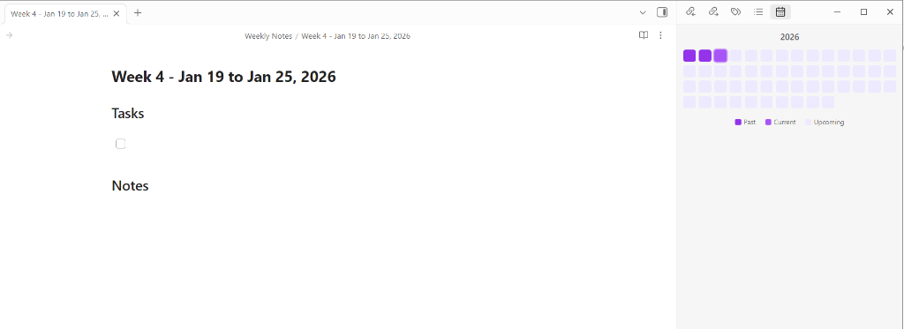

# Weekly Heatmap for Obsidian

A simple Obsidian plugin that displays a 52-week heatmap calendar. Click on any week to open (or create) a corresponding weekly note.



## Features

- 📅 **52-Week Heatmap View** - Visual overview of your entire year
- 🎨 **Visual Distinction** - Past/current weeks are highlighted differently from future weeks
- 📝 **Quick Weekly Notes** - Click any week to open or create a weekly note
- 🏷️ **Smart Naming** - Notes are automatically titled with format: `Week [number]: [Monday] - [Sunday]`

## Installation

### From Obsidian Community Plugins (Recommended)
1. Open Obsidian Settings
2. Go to **Community Plugins** and disable **Safe Mode**
3. Click **Browse** and search for "Weekly Heatmap"
4. Click **Install**, then **Enable**

### Manual Installation
1. Download the latest release from the [Releases page](https://github.com/aj-abhinai/weekly-heatmap/releases)
2. Extract the files into your vault's plugins folder: `<vault>/.obsidian/plugins/weekly-heatmap/`
3. Reload Obsidian
4. Enable the plugin in Settings → Community Plugins

### For Developers
1. Clone this repository into your vault's plugins folder:
   ```bash
   cd <vault>/.obsidian/plugins/
   git clone https://github.com/aj-abhinai/weekly-heatmap.git
   cd weekly-heatmap
   ```
2. Install dependencies:
   ```bash
   npm install
   ```
3. Build the plugin:
   ```bash
   npm run build
   ```
4. Reload Obsidian and enable the plugin in Settings → Community Plugins

## Usage

1. Click the calendar icon in the ribbon or use the command palette to open "Weekly Heatmap"
2. View the 52-week heatmap in the sidebar
3. Click on any week to open or create a weekly note
4. Weekly notes are automatically created in the `Weekly Notes` folder

## Development

- `npm run dev` - Start development build with watch mode
- `npm run build` - Create production build

## License

MIT License - see [LICENSE](LICENSE) file for details

## Support

If you find this plugin helpful, please consider:
- ⭐ Starring the repository
- 🐛 Reporting bugs or requesting features via [Issues](https://github.com/aj-abhinai/weekly-heatmap/issues)
- 🤝 Contributing via pull requests

---

<a href="https://buymeacoffee.com/aj_abhinai" target="_blank"></a>
